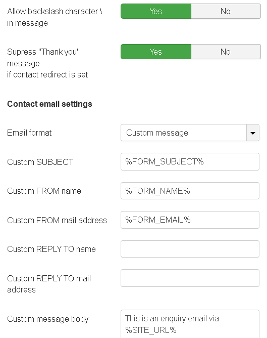

# Contact Form Enhancer
This Joomla plugin extends the functionality of the core contact form behavior. It allows for customizing standard contact form email messages, removing some limitations and adding the auto responder functionality.

* You can **customize the email body and headers** that will be sent after the contact form is submitted. You can, for example, completely remove default message text such as "This is an enquiry email via..." or your site name from the subject.
* You can activate and customize the **automatic reply** to be sent after the form is submitted.
* You can **suppress "Thank you" message** if contact redirect is set. By default, after mail is sent, a "Thank you" message is displayed. This may be annoying and requiring a user to close the message. Usually, when a contact redirect is set, the target page already contains some sort of confirmation. So when you suppress the message, the default "Thank you" message will not be shown. If a contact has no redirect (user stays on the same page after mail is sent), the default "Thank you" message will always be shown, regardless of this option.
* Plugin allows inserting of **single backslash character** in contact form. Standard form removes this character in the email. This plugin allows you to receive exactly the same text that was entered in the contact form.

You can insert special variables in your email templates. They will be replaced by actual values when a mail is sent.

## List of variables:

**%FORM_SUBJECT%** - subject entered in the contact form 
**%FORM_NAME%** - name entered in the contact form 
**%FORM_EMAIL%** - email entered in the contact form 
**%FORM_MESSAGE%** - message entered in the contact form 
**%SITE_NAME%** - site name 
**%SITE_URL%** - site URL 
**%SITEFROMNAME%** - From Name specified in Global Configuration > Server > Mail Settings 
**%SITEFROMEMAIL%** - From Email specified in Global Configuration > Server > Mail Settings 
